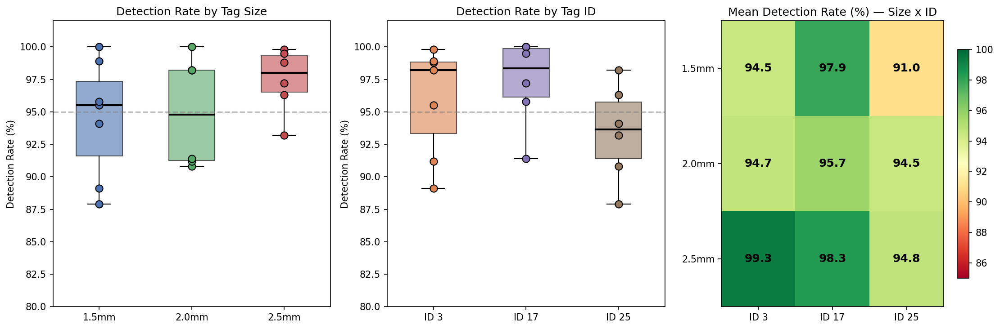
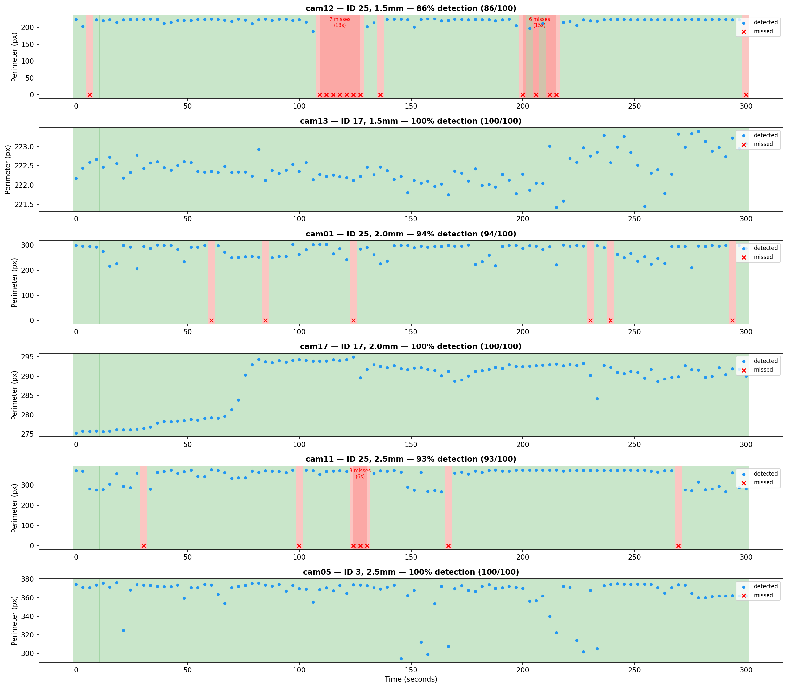
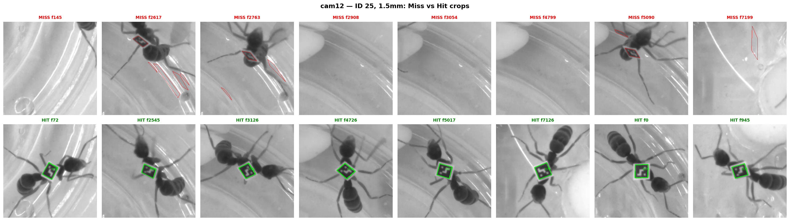
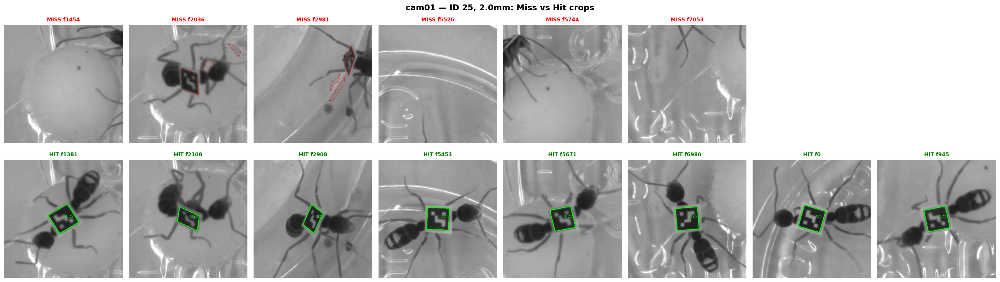
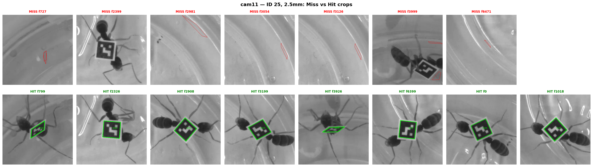

# ArUco Detection Benchmark Protocol

## Objective

Identify what limits ArUco detection performance on ant-mounted markers and
find optimal parameters for reliable detection.

Two parallel investigation tracks:

- **Track A** — Physical tag size (1.5, 2.0, 2.5 mm)
- **Track B** — OpenCV detector parameter tuning

---

## Track A — Tag Size Experiment

### Materials

- Tag sheet generated with `generate_tag_sheet.py` at 1200 DPI
- Laser printer with matte paper (avoid glossy — causes specular reflections)
- Same adhesive mounting method as current tags

### Procedure

1. **Generate tag sheet:**
   ```bash
   python benchmark/generate_tag_sheet.py --dpi 1200 --sizes 1.5,2.0,2.5 --ids 0-29
   ```

2. **Print & verify:** Print at "actual size" / 100% scale. Measure the 10 mm
   ruler bar on the printout — it must be exactly 10 mm. If not, adjust
   printer scaling.

3. **Cut tags:** Separate tags by size group. Each ant gets one tag of one
   size. Use at least 5 ants per size group for statistical power.

4. **Film:** Identical camera, lighting, and arena conditions for all groups.
   Minimum 10 minutes per group. Record which ant ID maps to which size.

5. **Run detection:**
   ```bash
   python benchmark/run_size_comparison.py \
       --video-dir <dir_with_per_ant_videos> \
       --skip 6 --max-read-frames 7200 \
       --target-ids 3,17,25 \
       --output-csv benchmark/size_comparison_results.csv
   ```

6. **Compare metrics:**
   - Detection rate = frames with detection / total frames, per ant
   - Tag size inferred from detected corner perimeter (k-means clustering)

### Results (2026-03-31)

**Setup:** 19 ants filmed across 19 cameras (4024x3036 @ 24fps), one ant per
camera. Tag IDs 3, 17, 25 printed at 1.5, 2.0, 2.5 mm (two sets of three
sizes). Each tag is DICT_4X4_1000 (6x6 cells). At camera resolution, tags
span ~70-80 px per edge (~12-13 px/cell).

**Data:** `Z:\ReiterU\Ants\basler\QRcodes_test\ARUCO_size_comparison_15_20_25\20260331_01`

**Detection rates by tag size:**

| Size  |  n | Mean   | Std   | Min   | Max    |
|-------|---:|--------|-------|-------|--------|
| 1.5mm |  7 | 94.5%  | 4.6%  | 87.9% | 100.0% |
| 2.0mm |  6 | 95.0%  | 4.3%  | 90.8% | 100.0% |
| 2.5mm |  6 | 97.5%  | 2.5%  | 93.2% |  99.8% |

**Detection rates by tag ID:**

| ID |  n | Mean   | Std   | Min   | Max    |
|----|---:|--------|-------|-------|--------|
|  3 |  7 | 95.9%  | 4.2%  | 89.1% |  99.8% |
| 17 |  6 | 97.3%  | 3.4%  | 91.4% | 100.0% |
| 25 |  6 | 93.4%  | 3.7%  | 87.9% |  98.2% |

**Mean detection rate (%) — Size x ID:**

|       | ID 3 | ID 17 | ID 25 |
|-------|-----:|------:|------:|
| 1.5mm | 94.5 |  97.9 |  91.0 |
| 2.0mm | 94.7 |  95.7 |  94.5 |
| 2.5mm | 99.3 |  98.3 |  94.8 |

**Conclusions:**

1. **Tag size has a modest effect** — 2.5mm is ~3% better than 1.5mm on
   average, but all sizes achieve >87% detection rate. At ~12-13 px/cell,
   all sizes are well above the OpenCV detection floor.
2. **ID matters** — ID 17 consistently outperforms ID 25 by ~4%. Tag bit
   patterns affect detection robustness (error correction sensitivity).
3. **Camera-to-camera variation dominates** — within-size std (3-5%) exceeds
   the between-size difference (~3%), suggesting lighting and viewing angle
   have more impact than physical tag dimensions.
4. **Recommendation:** 2.0mm is a good compromise (95% detection, minimal
   impact on ant behavior). Parameter tuning (Track B) may yield larger
   gains than further size increases.



---

## Track B — Parameter Tuning

### Setup

6 cameras selected: 2 per tag size, covering different IDs and performance
levels. 100 sample frames extracted per camera from the first 5 min of
footage.

| Size  | Camera | Tag ID | Baseline rate | Role  |
|-------|--------|--------|---------------|-------|
| 1.5mm | cam12  | 25     | 87.9%         | worst |
| 1.5mm | cam13  | 17     | 100.0%        | best  |
| 2.0mm | cam01  | 25     | 90.8%         | low   |
| 2.0mm | cam17  | 17     | 100.0%        | best  |
| 2.5mm | cam11  | 25     | 93.2%         | low   |
| 2.5mm | cam05  | 3      | 99.8%         | best  |

### Procedure

1. **Extract sample frames:**
   ```bash
   python benchmark/extract_sample_frames.py \
       --video <path> --output-dir benchmark/sample_frames/<cam> --n-frames 100
   ```

2. **One-at-a-time sweep per camera:**
   ```bash
   python benchmark/aruco_benchmark.py \
       --image-dir benchmark/sample_frames/<cam> \
       --sweep-mode one-at-a-time \
       --output-dir benchmark/results_oat_<cam>/
   ```

3. **Pool results by tag size** — average across 2 cameras per size group to
   separate parameter effects from camera-specific variation.

### Results (2026-03-31)

**Baseline detections/frame** (1 ant per camera, ideal = 1.00):
1.5mm = 1.07, 2.0mm = 1.26, 2.5mm = 1.31, overall = 1.21.
Values >1.0 indicate some false positives even at baseline.

**Mean detections/frame by tag size (averaged across 2 cameras per size):**

| Parameter                    | Value                | 1.5mm | 2.0mm | 2.5mm |  All  |
|------------------------------|----------------------|------:|------:|------:|------:|
| baseline                     | current              |  1.07 |  1.26 |  1.31 |  1.21 |
| `minMarkerPerimeterRate`     | 0.005                |  1.89 |  2.03 |  1.95 |  1.95 |
| `minMarkerPerimeterRate`     | 0.01                 |  1.71 |  1.96 |  1.69 |  1.79 |
| `minMarkerPerimeterRate`     | 0.02                 |  1.34 |  1.42 |  1.51 |  1.42 |
| `adaptiveThreshWinSizeStep`  | 5                    |  1.13 |  1.50 |  1.51 |  1.38 |
| `adaptiveThreshWinSizeMax`   | 60                   |  1.20 |  1.38 |  1.53 |  1.37 |
| sharpen (unsharp mask)       | yes                  |  1.17 |  1.33 |  1.41 |  1.30 |
| CLAHE                        | clip=2.0             |  0.85 |  1.02 |  1.01 |  0.96 |
| CLAHE                        | clip=4.0             |  0.56 |  0.57 |  0.65 |  0.59 |
| `cornerRefinementMethod`     | CORNER_REFINE_APRILTAG | 0.93 | 0.86 |  0.96 |  0.92 |
| `cornerRefinementMethod`     | CORNER_REFINE_SUBPIX |  1.07 |  1.26 |  1.31 |  1.21 |
| `adaptiveThreshConstant`     | 5                    |  0.95 |  1.08 |  1.24 |  1.09 |
| `adaptiveThreshConstant`     | 7                    |  0.95 |  1.04 |  1.06 |  1.02 |
| `adaptiveThreshConstant`     | 10                   |  0.93 |  1.00 |  0.99 |  0.97 |
| `errorCorrectionRate`        | 0.5                  |  1.07 |  1.26 |  1.31 |  1.21 |
| `errorCorrectionRate`        | 0.8                  |  1.07 |  1.26 |  1.31 |  1.21 |

**Improvement over baseline (delta detections/frame):**

| Parameter                    | Value  | d1.5mm | d2.0mm | d2.5mm |  dAll |
|------------------------------|--------|-------:|-------:|-------:|------:|
| `minMarkerPerimeterRate`     | 0.005  |  +0.81 |  +0.77 |  +0.64 | +0.74 |
| `minMarkerPerimeterRate`     | 0.01   |  +0.64 |  +0.70 |  +0.38 | +0.57 |
| `minMarkerPerimeterRate`     | 0.02   |  +0.26 |  +0.16 |  +0.20 | +0.21 |
| `adaptiveThreshWinSizeStep`  | 5      |  +0.05 |  +0.24 |  +0.20 | +0.17 |
| `adaptiveThreshWinSizeMax`   | 60     |  +0.12 |  +0.12 |  +0.22 | +0.16 |
| sharpen (unsharp mask)       | yes    |  +0.09 |  +0.07 |  +0.10 | +0.09 |
| CLAHE                        | clip=2 |  -0.22 |  -0.24 |  -0.29 | -0.25 |
| CORNER_REFINE_APRILTAG       | —      |  -0.15 |  -0.40 |  -0.35 | -0.30 |

### Conclusions (parameter sweep)

1. **`minMarkerPerimeterRate` appeared dominant** — lowering it from the
   OpenCV default (0.03) dramatically increased detections/frame. However,
   false positive analysis (below) revealed this was entirely spurious.
2. **The ranking is consistent across all 3 tag sizes** — no size-specific
   tuning needed.
3. **CLAHE and APRILTAG refinement are harmful** — both reduce detection
   rates across all sizes. Skip them.
4. **Mild sharpening helps modestly** (+0.09) with no downside.
5. **`errorCorrectionRate` and `CORNER_REFINE_SUBPIX` have zero effect** —
   keep defaults.

---

## False Positive Analysis

### Motivation

The parameter sweep showed that lowering `minMarkerPerimeterRate` increased
detections/frame from ~1.0 to ~2.0 on single-ant videos. To determine
whether these extra detections were real (previously missed) or false
positives, we analyzed per-ID detection counts and perimeters at each rate
value across all 6 test cameras.

### Method

For each camera, ran detection at `minMarkerPerimeterRate` = 0.03 (baseline),
0.02, 0.01, 0.005. Compared the true ID detection count (the known ant tag)
against all other detected IDs, and recorded corner perimeters for each.

### Results

**True ID detection counts are identical at all rate values:**

| Camera | True ID | Size  | rate=0.03 | rate=0.02 | rate=0.01 | rate=0.005 |
|--------|---------|-------|----------:|----------:|----------:|-----------:|
| cam12  | 25      | 1.5mm |    86/100 |    86/100 |    86/100 |     86/100 |
| cam13  | 17      | 1.5mm |   100/100 |   100/100 |   100/100 |    100/100 |
| cam01  | 25      | 2.0mm |    94/100 |    94/100 |    94/100 |     94/100 |
| cam17  | 17      | 2.0mm |   100/100 |   100/100 |   100/100 |    100/100 |
| cam11  | 25      | 2.5mm |    93/100 |    93/100 |    93/100 |     93/100 |
| cam05  | 3       | 2.5mm |   100/100 |   100/100 |   100/100 |    100/100 |

Lowering the rate does **not** recover any missed true detections. The missed
frames (e.g., 86/100 on cam12) are true failures — likely motion blur or
steep viewing angles — not perimeter filtering.

**All extra detections are false positives:**

| rate  | Total true | Total false | Unique FP IDs | FP with perim < 200px |
|-------|------------|-------------|---------------|----------------------:|
| 0.030 |        573 |          36 |            26 |                36.1%  |
| 0.020 |        573 |          55 |            36 |                58.2%  |
| 0.010 |        573 |          76 |            44 |                69.7%  |
| 0.005 |        573 |          77 |            45 |                70.1%  |

**Recurring false positive IDs across cameras:**

- **ID 190** — most frequent FP; detected in cam12, cam01, cam17
- **ID 683** — detected in 5 out of 6 cameras
- **ID 37** — detected in 3 cameras

These are likely arena features (edges, corners, debris) that resemble
4x4 ArUco bit patterns.

**Perimeter distributions:**

|        | Mean   | Std  | Min  | Max  |
|--------|--------|------|------|------|
| True   | 287 px | 59   | 188  | 376  |
| False  | 205 px | 176  | 40   | 818  |

True detections have tight, consistent perimeters. False positives are
highly variable — many very small (noise), some very large (arena features).

### Conclusions (false positive analysis)

1. **Do not lower `minMarkerPerimeterRate`** — the default 0.03 is correct.
   Real tags already pass the filter at all tested values. Lowering it only
   adds false positives.
2. **The initial sweep was misleading** — the increased detections/frame at
   lower rates were entirely false positives, not recovered true detections.
3. **True detection failures (6-14% of frames) are not caused by the
   perimeter filter.** Root cause investigated below.
4. **Post-processing perimeter filter is viable** — if needed, rejecting
   detections with perimeter < 200px would eliminate ~70% of false positives
   while keeping 100% of true detections (true min perimeter = 188px). A
   more conservative threshold of 150px would remove ~54% of FPs with zero
   risk to true detections.
5. **Recurring FP IDs (190, 683, 37) could be blacklisted** if they are not
   assigned to any real ant, as an additional safeguard.

---

## Detection Failure Analysis

### Motivation

Cameras with ID 25 showed 86-93% detection rates while ID 17 and ID 3
cameras achieved 100%. We investigated whether the 6-14% missed frames
are caused by image quality, tag geometry, or tag bit-pattern complexity.

### Time series consistency

Detection status was plotted over time for all 6 test cameras.



**Observations:**

- **ID 17 and ID 3 cameras** (cam13, cam17, cam05) show 100% detection
  with no gaps across the entire 5-minute sample.
- **ID 25 cameras** (cam12, cam01, cam11) show **clustered miss bands** —
  misses occur in bursts of 5-30 seconds, not as isolated random events.
- On cam12, frames 2617-3054 (indices 36-42) form a cluster of **7
  consecutive misses** (~18 seconds of footage).
- Perimeter values remain stable on hit frames, indicating consistent
  tag-to-camera distance when detection succeeds.

### Image quality comparison (hit vs miss)

Global sharpness (Laplacian variance) and brightness were measured on
detected vs missed frames:

| Camera | Hit sharpness | Miss sharpness | Hit brightness | Miss brightness |
|--------|---------------|----------------|----------------|-----------------|
| cam12  | 3.2 ± 0.3     | 3.1 ± 0.1     | 215.3 ± 0.3   | 215.4 ± 0.2    |
| cam01  | 5.8 ± 0.3     | 5.8 ± 0.1     | 159.6 ± 0.3   | 159.8 ± 0.2    |
| cam11  | 4.3 ± 0.3     | 4.1 ± 0.0     | 185.1 ± 0.3   | 185.1 ± 0.2    |

**No difference in global image quality** between hit and miss frames.
Sharpness and brightness are essentially identical. The misses are not
caused by motion blur or lighting changes.

### Visual inspection of miss vs hit frames

Cropped regions around the ant position were compared between missed and
successfully detected frames.

**cam12 — ID 25, 1.5mm (86% detection):**



**cam01 — ID 25, 2.0mm (94% detection):**



**cam11 — ID 25, 2.5mm (93% detection):**



**Observations across all three cameras:**

- Missed frames consistently show the ant **near arena walls or edges**
  where the tag is tilted away from the camera (perspective distortion).
- Hit frames show the ant in **open arena** with the tag visible from
  above (near-perpendicular view).
- The tag itself is still physically present and visible in missed frames,
  but the perspective distortion prevents the detector from resolving the
  bit pattern.

### Bit pattern complexity

The 4x4 data region of each tag was analyzed for edge complexity
(number of black/white transitions):

| ID | Transitions | White cells | Mean rate | Min rate |
|----|------------:|------------:|----------:|---------:|
| 17 |       **6** |           4 |    97.3%  |    91.4% |
|  3 |          12 |           7 |    95.9%  |    89.1% |
| 25 |      **13** |           7 |    93.4%  |    87.9% |

ID 17 has the fewest transitions (large uniform regions — simple pattern),
making it the most robust to perspective distortion. ID 25 has the most
transitions (checkerboard-like complexity), requiring cleaner geometry to
resolve each cell boundary.

All three IDs have the same minimum Hamming distance (2) to their nearest
neighbor in DICT_4X4_1000, so error correction capability is equal. The
difference is purely in how well the pattern survives geometric distortion.

### Conclusions (failure analysis)

1. **Misses are caused by ant positioning near arena walls**, where the tag
   tilts away from the camera. This is a geometry problem, not a detection
   algorithm or image quality problem.
2. **Misses are temporally clustered** (5-30 second bursts), corresponding
   to periods when the ant stays near an edge. They are not random.
3. **ID 25's complex bit pattern (13 transitions) makes it more vulnerable**
   to perspective distortion than ID 17 (6 transitions) or ID 3 (12
   transitions). Simpler patterns survive the same viewing conditions.
4. **Global image quality (sharpness, brightness) does not predict misses.**
   The local geometry of the tag relative to the camera is the sole factor.
5. **These misses cannot be fixed by parameter tuning.** They require either:
   - Choosing IDs with fewer transitions (simpler bit patterns)
   - Multi-frame interpolation in the tracking pipeline to bridge gaps
   - Camera placement adjustments to reduce steep viewing angles at edges

---

## Overall Recommendations

Based on Track A, Track B, and failure analysis combined:

1. **Tag size:** 2.0mm is optimal — 95% detection with minimal impact on
   ant behavior.
2. **Tag ID selection:** Prefer IDs with **low transition counts** (fewer
   black/white boundaries). ID 17 (6 transitions) outperforms ID 25 (13
   transitions) by ~4% detection rate. Ranking all 1000 IDs by transition
   count would identify the most robust candidates.
3. **Detector parameters:** Keep current baseline settings in `run_aruco.py`.
   No parameter change improves true detection rate.
4. **Optional post-processing:** Add a perimeter-based filter (>150px) to
   reduce false positives without affecting true detections.
5. **Remaining 6-14% missed frames** are caused by ant positioning near
   arena walls (tag tilts away from camera). Mitigation options:
   - Choose low-transition IDs to maximize robustness
   - Interpolate through short miss gaps in the tracking pipeline
   - Adjust camera angles to reduce perspective distortion at arena edges

---

## Output Files

```
benchmark/
├── tag_sheet.png                    # Printable multi-size tag sheet
├── generate_tag_sheet.py            # Tag sheet generator
├── extract_sample_frames.py         # Frame extraction utility
├── run_size_comparison.py           # Track A: per-ant video analysis
├── aruco_benchmark.py               # Track B: parameter sweep engine
├── size_comparison_results.csv      # Track A: raw results
├── size_comparison_plot.png         # Track A: visualization
├── timeseries_detection.png         # Time series consistency plot
├── visual_inspection_cam*.png       # Hit vs miss frame montages
├── sample_frames/                   # Extracted frames per camera
│   ├── cam01/ cam05/ cam09/ cam11/ cam12/ cam13/ cam17/
├── results_oat_cam*/                # One-at-a-time sweep results per camera
│   ├── benchmark_results.csv
│   └── sweep_*.png                  # Per-parameter plots
└── protocol.md                      # This file
```
