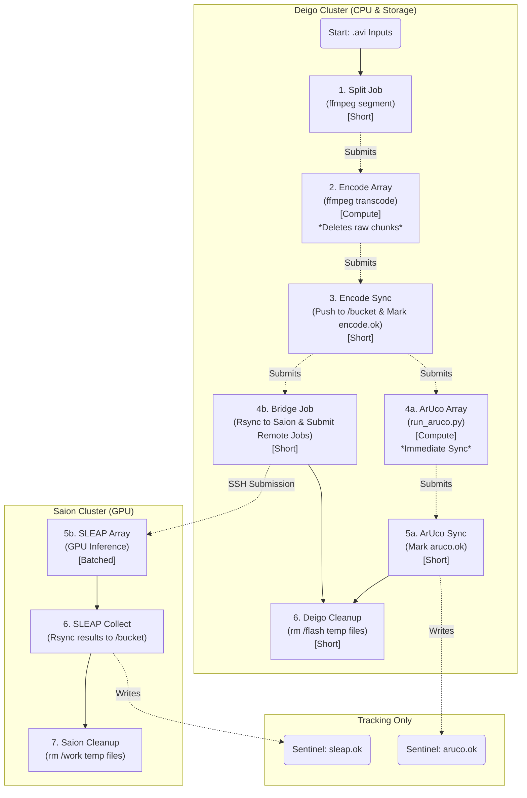

```mermaid

graph TD

    subgraph Deigo["Deigo Cluster (CPU & Storage)"]
        Start(Start: .avi Inputs) --> Split["1. Split Job<br/>(ffmpeg segment)<br/>[Short]"]
        
        Split -.-> |Submits| EncArray["2. Encode Array<br/>(ffmpeg transcode)<br/>[Compute]<br/>*Deletes raw chunks*"]
        EncArray -.-> |Submits| EncSync["3. Encode Sync<br/>(Push to /bucket & Mark encode.ok)<br/>[Short]"]

        EncSync -.-> |Submits| ArucoArray["4a. ArUco Array<br/>(run_aruco.py)<br/>[Compute]<br/>*Immediate Sync*"]
        EncSync -.-> |Submits| Bridge["4b. Bridge Job<br/>(Rsync to Saion & Submit Remote Jobs)<br/>[Short]"]
        
        ArucoArray -.-> |Submits| ArucoSync["5a. ArUco Sync<br/>(Mark aruco.ok)<br/>[Short]"]
        
        Bridge --> DeigoCleanup["6. Deigo Cleanup<br/>(rm /flash temp files)<br/>[Short]"]
        ArucoSync --> DeigoCleanup
    end

    subgraph Saion["Saion Cluster (GPU)"]
        Bridge -.-> |SSH Submission| SleapArray["5b. SLEAP Array<br/>(GPU Inference)<br/>[Batched]"]
        SleapArray --> SleapCollect["6. SLEAP Collect<br/>(Rsync results to /bucket)"]
        SleapCollect --> SaionCleanup["7. Saion Cleanup<br/>(rm /work temp files)"]
    end

    subgraph Coordination["Tracking Only"]
        SleapCollect -.-> |Writes| SleapSignal("Sentinel: sleap.ok")
        ArucoSync -.-> |Writes| ArucoSignal("Sentinel: aruco.ok")
    end
```